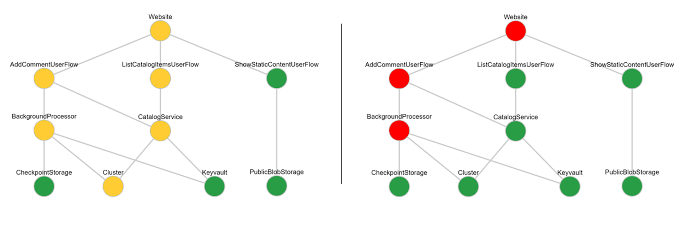
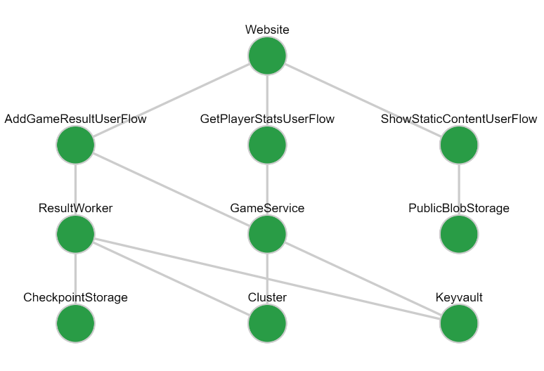

# Grafana Health Model Panel

This repo contains a custom Grafana panel used for visualizing a health model based on KQL queries. 



The health model panel was developed in support of the [Azure Mission Critical project](https://github.com/azure/mission-critical). Azure Mission-Critical is an open source project that provides a prescriptive architectural approach to building highly-reliable cloud-native applications on Microsoft Azure for mission-critical workloads. For more context on the application of this Grafana plugin, please refer to the Mission Critical project. 

The health model has been implemented in Azure Log Analytics using KQL queries. This is a custom Grafana visualization panel, which can be used to visualize that health model. It's main purpose is to visualize, in an intuitive way:

- The health state of each component
- The hierarchical dependencies between components.


## Contents
When the Dockerfile is built, a container is created with the following:

- Grafana
- Azure Monitor data source
- Healthmodelpanel custom visualization

## Environment Variables
The container expects the following environment variables to be set:

| Name | Value   |
|------|---------|
| GRAFANA_USERNAME | Username for the Grafana instance |
| GRAFANA_PASSWORD | Password used with username |
| AZURE_DEFAULT_SUBSCRIPTION | Id of the Azure subscription that holds the Log Analytics instances |

## Managed Identity
The data source has been set for Managed Identity authentication to Azure.
This means that the infrastructure running the container, e.g. Azure App Service, should have its system-managed identity enabled and that identity should be assigned, at minimum, the 'Log Analytics Reader' permission on a scope that includes all required Log Analytics instances.

If you do not want to use the managed identity for connecting to Log Analytics, you can edit or remove config/provisioning/datasources/azure-monitor.yaml.

## Grafana Authentication
Currently, authentication has been set to a username/password. Obviously this is not the best way in production scenarios, but OAuth authentication requires external dependencies that make this reference implementation harder to deploy and may be subject to security constraints in your local environment. 

Before deploying this to your production environment, it is *highly recommended* to enable OAuth. This is done by editing the grafana.ini file and uncommenting/filling the values under the authentication section. Naturally, don't add secrets there. You can add ${MY_SECRET_VALUE} as a value and include that at runtime through environment variables. 

## Usage

### Input Data

The panel depends on a Log Analytics query result that contains the relevant information. The following columns are required in the query result:

- **ComponentName** is the name of the component as it is displayed in the health model graph.
- **Dependencies** holds a comma-separated list of components that the specific component depends on. The names should match the 'ComponentName' value of the respective component.
- **HealthScore** is used to determine the color of the visualization. The values used here should match with the threshold values described in the panel options.

As an example, the query we use in the reference implementation is:

```kql
WebsiteHealthScore
| union ViewClaimUserFlowHealthScore
| union PostClaimUserFlowHealthScore
| union EventHubHealthScore
| union KeyvaultHealthScore
| union ClaimServiceHealthScore
| union ClaimWorkerHealthScore
| union ClusterHealthScore
```

This gives the following result, which is the input for the health model panel:

| ComponentName     | HealthScore | Dependencies                        |
| :---------------- | :---------- | :---------------------------------- |
| Website           | 1           | ViewClaimUserFlow,PostClaimUserFlow |
| ViewClaimUserFlow | 1           | ClaimService,Keyvault               |
| PostClaimUserFlow | 1           | Eventhub,ClaimWorker,Keyvault       |
| ClaimService      | 1           | Cluster                             |
| ClaimWorker       | 1           | Cluster                             |
| EventHub          | 1           |                                     |
| Keyvault          | 1           |                                     |
| Cluster           | 1           |                                     |

This query is subsequently visualized in the following way:


# Build & Deploy

## Option 1: Docker Build for the entire Grafana container

1. Docker build:
   `docker build -t grafana-healthmodelpanel .`

This docker container contains a full Grafana install as well as the healthmodel panel and can be run directly on any container hosting environment. The required environment variable for running unsigned panels has already been set.

## Option 2: Manually Build the healthmodel panel

1. Go to the _healthmodelpanel_ directory

2. Install packages:
   `yarn install`

3. Build the project:
   `yarn build`

4. Copy `./dist/*` to `/var/lib/grafana/plugins/healthmodelpanel` of your Grafana installation.

5. In order to run an unsigned Grafana panel, ensure that the following environment variable has been set:
   `GF_PLUGINS_ALLOW_LOADING_UNSIGNED_PLUGINS="healthmodelpanel"`

